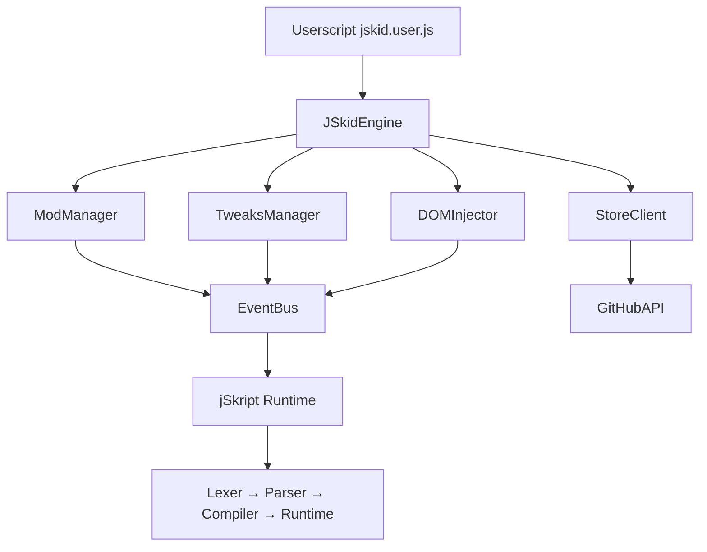
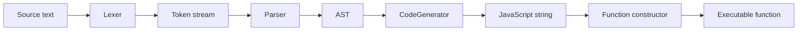

# jSkid Architecture

> Understand how jSkid works under the hood. Intended for contributors, mod authors, and advanced users.

---


## System Overview



jSkid runs as a Tampermonkey/Violentmonkey userscript on `https://janitorai.com/*`. It loads as a single IIFE that bootstraps the `JSkidEngine`.

---


## Core Components

### Engine (`src/core/engine.js`)

The main orchestrator. Responsibilities:

- Initialize subsystems in order
- Inject the launcher UI into the page
- Observe route changes via `MutationObserver`
- Manage global state (theme, settings, mods)
- Expose public API on `window.jskidEngine`

**Initialization order:**

1. Open/initialize IndexedDB via `Storage`
2. Lazy-init `ModManager`, `StoreClient`, `TweaksManager`
3. Run `ModManager.init()` (loads persisted mod configs)
4. Inject core CSS styles
5. Build launcher button + popup UI
6. Start DOM observer for SPA route changes
7. Emit `jskid:ready` event

### EventBus (`src/core/event-bus.js`)

Pub/sub event system. Used for:

- Decoupling subsystems (mods don't import the engine directly)
- Runtime events: `chat:message`, `page:navigate`, `jskid:ready`
- Hook-based extensions

Events are stored in a `Map<string, Set<fn>>`. `emit()` calls all listeners synchronously.

### Storage (`src/core/storage.js`)

IndexedDB wrapper via `GM_xmlhttpRequest` fallback. Stores:

- `settings` — user preferences key/value
- `installed_mods` — enabled state, config overrides per mod
- `mod_logs` — recent mod output for debugging
- `chat_history` — cached messages for mods to read

### DOM Injector (`src/core/dom-injector.js`)

Injects jSkid UI elements into JanitorAI's DOM:

- Appends styles to `<head>`
- Creates the launcher button
- Observes `<main>` changes for SPA navigation

### JanitorAPI (`src/core/janitor-api.js`)

Thin wrapper around JanitorAI's internal APIs. Provides safe access to:

- Chat input/read/write
- Character data
- UI selectors
- Page state

---


## jSkript Compiler Pipeline



1. **Lexer** (`src/jskript/lexer.js`) — tokenizes raw text
2. **Parser** (`src/jskript/parser.js`) — builds AST
3. **Compiler** (`src/jskript/compiler.js`) — walks AST, emits JS
4. **Runtime** (`src/jskript/runtime.js`) — execution context, scope, helpers

The compiler produces a function with signature `(scope, global) => { ... }`. `scope` is the mod's private variable store. `global` exposes safe APIs.

---


## Mod System

### Manager (`src/mods/manager.js`)

Single `ModManager` class. Simplified data model:

```
this.mods = Map<modId, { manifest, enabled, source, config }>
```

Lifecycle:

1. `init()` — load persisted state from IndexedDB
2. `install(source)` — fetch/store mod source, validate permissions
3. `enable(id)` — compile jSkript, bind events
4. `disable(id)` — unbind events, clear intervals/timeouts
5. `uninstall(id)` — remove source + config

### Permissions (`src/mods/permissions.js`)

Declarative permission system. Each mod declares needs in `manifest.json`:

```json
{
  "permissions": ["read:chat", "write:chat", "http:api.example.com"]
}
```

Permissions are grouped:

| Group | Grants |
|---|---|
| `read:chat` | Read chat messages |
| `write:chat` | Send messages |
| `read:ui` | Access DOM elements |
| `write:ui` | Modify DOM |
| `read:storage` / `write:storage` | IndexedDB access |
| `http:*` | `GM_xmlhttpRequest` to any URL |
| `websocket:*` | WebSocket access |
| `sound` | Play audio |
| `clipboard` | Read/write clipboard |

---


## Store System

### Client (`src/store/client.js`)

HTTP client using `GM_xmlhttpRequest`. Fetches the remote index from GitHub raw content. Handles 404/offline gracefully by showing an error state in the UI.

### GitHub (`src/store/github.js`)

GitHub API wrapper for:

- Fetching raw file content
- Creating/updating issues/PRs
- Getting repo metadata

### UI

- **Browser** (`src/store/ui/browser.js`) — searchable mod grid
- **Detail** (`src/store/ui/detail.js`) — mod info page
- **Upload** (`src/store/ui/upload.js`) — mod submission wizard

### Installer (`src/store/installer.js`)

Downloads mod source, validates manifest, installs via `ModManager`.

---


## Tweaks System

### Manager (`src/tweaks/manager.js`)

Registry of small UI/behavior toggles. Organized by category:

- **appearance** — theme, fonts, animations
- **chat** — timestamps, avatars, message grouping
- **performance** — lazy load, debounce, reduce motion
- **privacy** — disable tracking, incognito mode
- **notifications** — sounds, badges, desktop alerts

Each tweak is a simple object:

```js
{
  id: "show-timestamps",
  category: "chat",
  label: "Show message timestamps",
  default: true,
  toggle(el) { el.classList.toggle("jskid-hide-timestamps"); }
}
```

---


## Data Flow Example: Chat Auto-Reply

1. JanitorAI receives a chat message
2. `DOMInjector` detects new message node via `MutationObserver`
3. `EventBus.emit("chat:message", { sender, text })`
4. `ModManager` routes event to all active mods that listen to `chat:message`
5. jSkript handler compiles and executes:
   ```jskript
   on chat message received:
     if message contains "hello":
       reply "Hi!"
     end if
   end on
   ```
6. jSkript `reply` calls `JanitorAPI.sendChatMessage()`
7. Message appears in chat UI

---


## Build & Release

### Local Development

1. Edit source files in `src/`
2. Build: `node scripts/bundle.js` (or just run `./release.sh`)
3. Install `jskid.user.js` in Tampermonkey

### Release (`./release.sh`)

1. Copies all source files to temp dir
2. Fixes GitHub URLs
3. Copies bundler script to `.github/scripts/`
4. Pushes source to `main` branch
5. Creates a Git tag like `v1.0.0`
6. GitHub Actions detects the tag
7. Runs `node .github/scripts/bundle.js` → produces `jskid.user.js`
8. Creates GitHub Release with `jskid.user.js` as asset

### CI (`release.sh` writes workflows)

- **on push to `main`**: syntax check all JS files, verify bundler exists
- **on tag push `v*`**: bundle userscript, create release
- **store repo on `mods/**` change**: validate mods, rebuild `index.json`, commit back

---


## Security Model

- All code runs client-side in the user's browser
- No telemetry, no external servers (except optional GitHub store queries)
- Permissions are explicit per-mod and shown to the user before install
- Mods are sandboxed to their own scope — they share the page DOM but not variables
- `GM_xmlhttpRequest` is the only network escape hatch